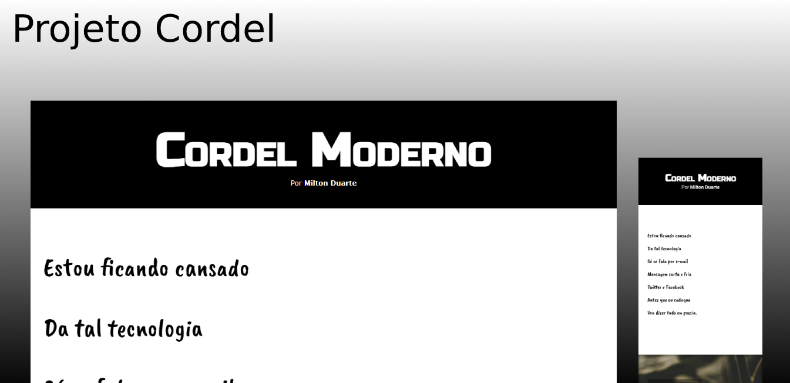

<h1 align="center">Projeto Cordel</h1>

  <a href="#-tecnologias">Tecnologias</a>&nbsp;&nbsp;&nbsp;|&nbsp;&nbsp;&nbsp;
  <a href="#-projeto">Projeto</a>&nbsp;&nbsp;&nbsp;|&nbsp;&nbsp;&nbsp;
  <a href="#memo-licença">Licença</a>

  

 

  

## 🚀 Tecnologias

Esse projeto foi desenvolvido com as seguintes tecnologias:

- HTML e CSS
- Git e Github

## 💻 Projeto

Projeto de um site de um cordel escrito por <a href="https://www.recantodasletras.com.br/poesias/3186743" target="_blank">Milton Duarte</a>, proposto pelo Curso em Vídeo no curso de HTML5 e CSS3. Com imagens e efeito parallax.

## :memo: Licença

Esse projeto está sob a licença MIT.

---
